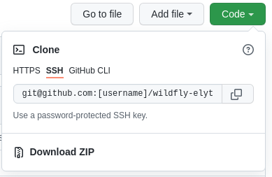
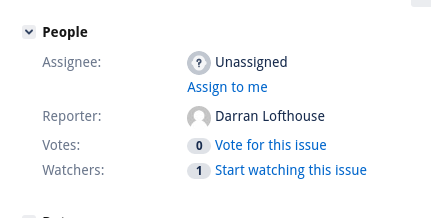

Contributing to Elytron Web
==================================

Welcome to the Elytron Web project! We welcome contributions from the community. This guide will walk you through the steps for getting started on our project.

- [Forking the Project](#forking-the-project)
- [Issues](#issues)
  * [Good First Issues](#good-first-issues)
- [Setting up your Developer Environment](#setting-up-your-developer-environment)
- [Contributing Guidelines](#contributing-guidelines)
- [Community](#community)


## Forking the Project 
To contribute, you will first need to fork the [elytron-web](https://github.com/wildfly-security/elytron-web) repository. 

This can be done by looking in the top-right corner of the repository page and clicking "Fork".


The next step is to clone your newly forked repository onto your local workspace. This can be done by going to your newly forked repository, which should be at `https://github.com/USERNAME/elytron-web`. 

Then, there will be a green button that says "Code". Click on that and copy the URL.



Then, in your terminal, paste the following command:
```bash
git clone [URL]
```
Be sure to replace [URL] with the URL that you copied.

Now you have the repository on your computer!

## Issues
The Elytron Web project uses JIRA to manage issues. All issues can be found [here](https://issues.redhat.com/projects/ELYWEB/issues). 

To create a new issue, comment on an existing issue, or assign an issue to yourself, you'll need to first [create a JIRA account](https://issues.redhat.com/).


### Good First Issues
Want to contribute to the Elytron Web project but aren't quite sure where to start? Check out our issues with the `good-first-issue` label. These are a triaged set of issues that are great for getting started on our project. These can be found [here](https://issues.redhat.com/issues/?filter=12383607). 

Once you have selected an issue you'd like to work on, make sure it's not already assigned to someone else. Then, remember to assign it to yourself, by clicking on "Assign to me", to prevent someone else from also working on the same issue.



It is recommended that you use a separate branch for every issue you work on. To keep things straightforward and memorable, you can name each branch using the JIRA issue number. This way, you can have multiple PRs open for different issues. For example, if you were working on [ELYWEB-146](https://issues.redhat.com/browse/ELYWEB-146), you could use ELYWEB-146 as your branch name.

## Setting up your Developer Environment

### Prerequisites

You will need:

* **JDK 25** (or later) - Required for building
* **Git** - For version control
* **Maven 3.9+** - For building and testing
* An [IDE](https://en.wikipedia.org/wiki/Comparison_of_integrated_development_environments#Java)
(e.g., [IntelliJ IDEA](https://www.jetbrains.com/idea/download/), [Eclipse](https://www.eclipse.org/downloads/), etc.)

**Note**: The project builds with Java 25 but targets Java 17 bytecode for backward compatibility with older LTS releases.

### Getting Started

First `cd` to the directory where you cloned the project (eg: `cd elytron-web`)

Add a remote ref to upstream, for pulling future updates:

```bash
git remote add upstream https://github.com/wildfly-security/elytron-web
```

### Building the Project

#### Simple Build and Test

The simplest way to build and test the project:

```bash
mvn clean install
```

This will:
- Compile the code with Java 25
- Target Java 17 bytecode (for backward compatibility)
- Run tests with Java 25

#### Build Without Tests

To build faster without running tests:

```bash
mvn clean install -DskipTests
```

#### Run Specific Test

To run only a specific test:

```bash
mvn clean install -Dtest=TestClassName
```

### Advanced Testing

#### Testing with Specific Java Versions

Our CI system tests the code against multiple Java versions (17, 21, and 25) and JDK distributions (Temurin and Semeru). You can reproduce these tests locally using Maven toolchains.

**Prerequisites for Multi-Version Testing**:

1. **Install Multiple JDKs**: You need Java 17, 21, and 25 installed
   - Recommended: Use [SDKMAN](https://sdkman.io/) for easy JDK management
   - Or download from [Adoptium](https://adoptium.net/) (Temurin) or [IBM Semeru](https://developer.ibm.com/languages/java/semeru-runtimes/)

2. **Configure Maven Toolchains**: Create or update `~/.m2/toolchains.xml`
   
   A template is provided in the project root: `toolchains.xml.template`
   
   Example configuration:
   ```xml
   <?xml version="1.0" encoding="UTF-8"?>
   <toolchains>
     <toolchain>
       <type>jdk</type>
       <provides>
         <version>17</version>
         <vendor>temurin</vendor>
       </provides>
       <configuration>
         <jdkHome>/path/to/jdk-17-temurin</jdkHome>
       </configuration>
     </toolchain>
     <toolchain>
       <type>jdk</type>
       <provides>
         <version>21</version>
         <vendor>temurin</vendor>
       </provides>
       <configuration>
         <jdkHome>/path/to/jdk-21-temurin</jdkHome>
       </configuration>
     </toolchain>
     <toolchain>
       <type>jdk</type>
       <provides>
         <version>25</version>
         <vendor>temurin</vendor>
       </provides>
       <configuration>
         <jdkHome>/path/to/jdk-25-temurin</jdkHome>
       </configuration>
     </toolchain>
     <!-- Add similar entries for Semeru distribution if needed -->
   </toolchains>
   ```

3. **Verify Toolchains Setup**:
   ```bash
   mvn toolchains:display-toolchains
   ```

**Testing with a Specific Java Version**:

```bash
# Test with Java 17 (Temurin)
mvn test -Djdk.test.version=17

# Test with Java 21 (Semeru)
mvn test -Djdk.test.version=21 -Djdk.test.vendor=semeru

# Test with Java 25 (default - uses build JDK)
mvn test
```

**Testing All Versions at Once**:

```bash
# Test with all LTS versions (17, 21, 25) using Temurin
mvn clean install -Ptest-all-versions

# Test with all LTS versions using Semeru
mvn install -Ptest-all-versions -Djdk.test.vendor=semeru
```

This will run the test suite three times (once for each Java version) and create separate test reports in:
- `target/surefire-reports-java17-{vendor}/`
- `target/surefire-reports-java21-{vendor}/`
- `target/surefire-reports-java25-{vendor}/`

### Continuous Integration

This project uses GitHub Actions to ensure code quality and compatibility across multiple Java versions and platforms.

#### Testing Strategy

**Build Once, Test Multiple Times**:
- Code is compiled once with Java 25, targeting Java 17 bytecode
- Tests are executed against multiple Java versions: 17, 21, and 25
- Tests run with two JDK distributions: Temurin (HotSpot) and Semeru (OpenJ9)
- Tests run on three platforms: Linux, Windows, and macOS

**Total Test Permutations**: 18 (3 Java versions × 2 distributions × 3 platforms)

#### CI Workflows

**Pull Request Testing** (`.github/workflows/pr-ci.yml`):
- Runs on every pull request
- Tests all 6 JDK permutations on Linux only
- Provides fast feedback (typically 10-15 minutes)
- Must pass before merging

**Nightly Testing** (`.github/workflows/ci-lts-nightly.yml`):
- Runs nightly at 2 AM UTC and on pushes to main branches
- Tests all 18 permutations (all platforms)
- Comprehensive coverage to catch platform-specific issues
- Scheduled to avoid resource contention with PR testing

**Non-LTS Testing** (`.github/workflows/ci-non-lts.yml`):
- Tests with latest non-LTS Java version (e.g., Java 26)
- Runs nightly at 3 AM UTC
- Helps prepare for next LTS release
- Can be disabled during LTS transition periods
- Failures don't block development

#### Reproducing CI Failures

If CI reports a failure on a specific Java version or distribution, you can reproduce it locally:

1. **Identify the failing permutation** from the CI logs (e.g., "Java 21 Semeru on Windows")

2. **Install the specific JDK** if you don't have it already

3. **Run tests with that configuration**:
   ```bash
   mvn test -Djdk.test.version=21 -Djdk.test.vendor=semeru
   ```

4. **Check the test reports** in `target/surefire-reports-java21-semeru/`

For more information, including details on how Elytron Web is integrated in WildFly Core and WildFly, check out our [developer guide](https://wildfly-security.github.io/wildfly-elytron/getting-started-for-developers/).

## Contributing Guidelines

When submitting a PR, please keep the following guidelines in mind:

1. In general, it's good practice to squash all of your commits into a single commit. For larger changes, it's ok to have multiple meaningful commits. If you need help with squashing your commits, feel free to ask us how to do this on your pull request. We're more than happy to help!

2. Please include the JIRA issue you worked on in the title of your pull request and in your commit message. For example, for [ELYWEB-146](https://issues.redhat.com/browse/ELYWEB-146), the PR title and commit message should be `[ELYWEB-146] Upgrade Undertow to 2.2.10.Final`.

3. Please include the link to the JIRA issue you worked on in the description of the pull request. For example, if your PR adds a fix for [ELYWEB-146](https://issues.redhat.com/browse/ELYWEB-146), the PR description should contain a link to https://issues.redhat.com/browse/ELYWEB-146.

For an example of a properly formatted PR, take a look at https://github.com/wildfly-security/elytron-web/pull/195

## Community
For more information on how to get involved with Elytron Web, check out our [community](https://wildfly-security.github.io/wildfly-elytron/community/) page.

## Legal

All contributions to this repository are licensed under the [Apache License](https://www.apache.org/licenses/LICENSE-2.0), version 2.0 or later, or, if another license is specified as governing the file or directory being modified, such other license.

All contributions are subject to the [Developer Certificate of Origin (DCO)](https://developercertificate.org/).
The DCO text is also included verbatim in the [dco.txt](https://github.com/wildfly-security/.github/blob/main/dco.txt) file in the .github repository of the wildfly-security organization.

## Compliance with Laws and Regulations

All contributions must comply with applicable laws and regulations, including U.S. export control and sanctions restrictions.
For background, see the Linux Foundation’s guidance:
[Navigating Global Regulations and Open Source: US OFAC Sanctions](https://www.linuxfoundation.org/blog/navigating-global-regulations-and-open-source-us-ofac-sanctions).